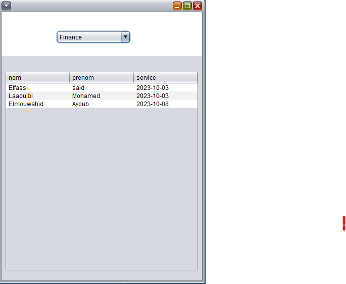

# J2E-JDBC
This Java project provides a interface for creation, modification and elimination of clients and services. This README contains covert information on how to configure this project.

# Client interface

# Client Modification

# Ajouter service

# Modifier service

#Supprimer service

# Rechercher par service

